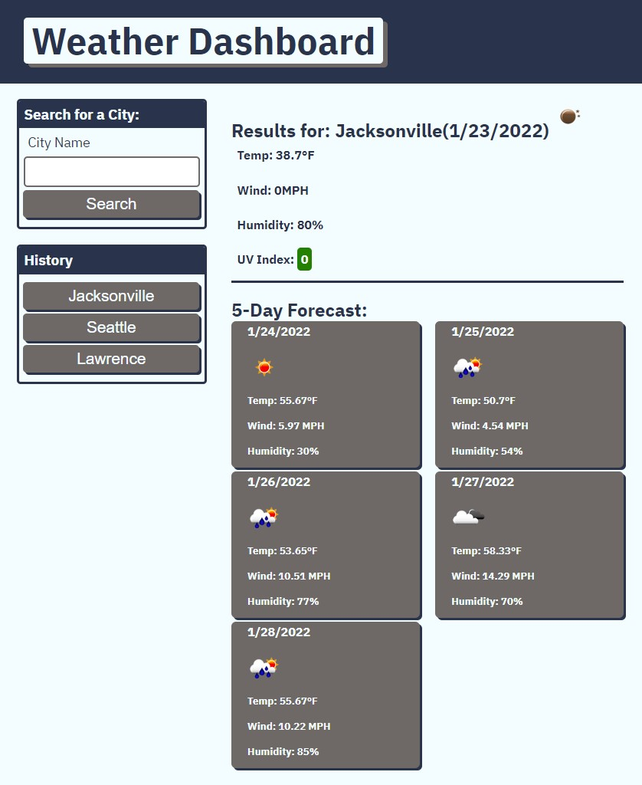

# Weather-Dashboard
 
 ## Description

This is my sixth challenge for the UofU bootcamp.  In it you will find a Weather Dashboard that lets you select a city and it will display the current weather and a 5-day forecast for that city.  It will save your responses to the history tab and and reselect any city you previously searched with just the click of a button.  

## What I Learned

This go around we learned about how to grab data from other websites and display it on our own webpage.  As my fourth JavaScript project I found this to still be a huge challenge.  The biggest issue this go around was getting all the server side api syntax correct. As always I will keep pushing forward in an attempt to grow and improve.

https://github.com/JohnKnee3/Weather-Dashboard
